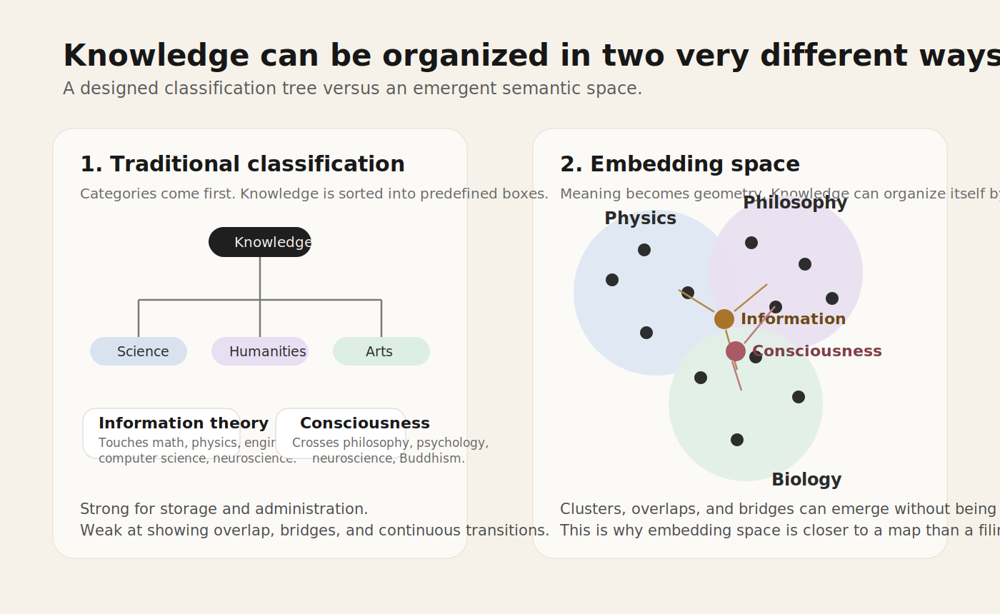
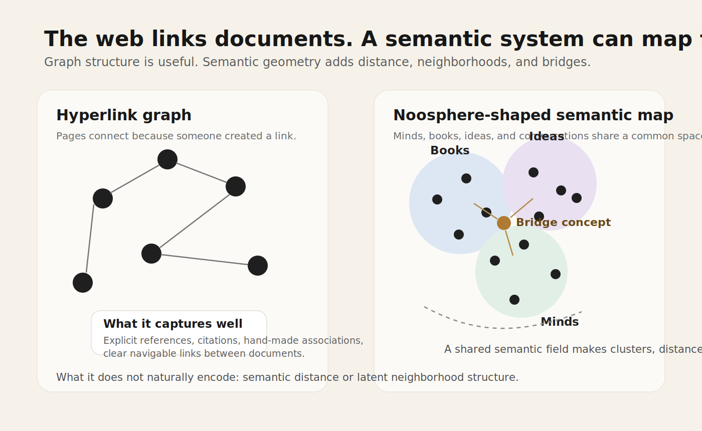
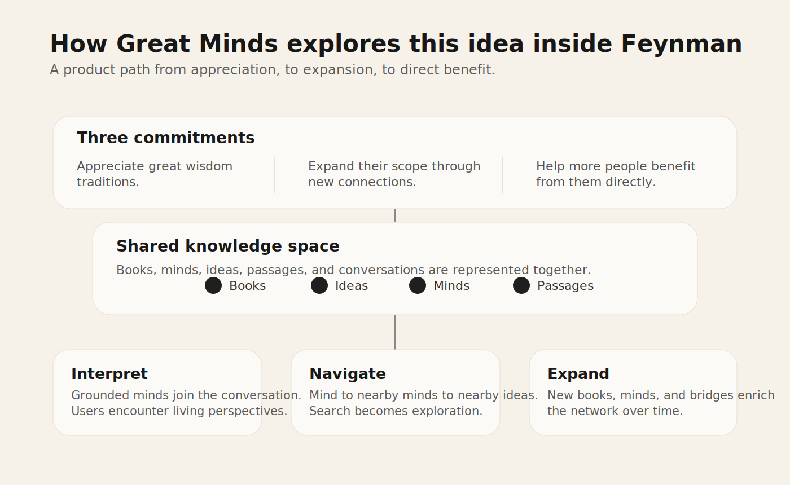

# Beyond Disciplines: Rethinking the Knowledge Network with Vector Space

*Written in collaboration with Claude Opus and GPT-5.4.*

Our work on Feynman starts from three commitments.

First, we want to **show our appreciation for humanity's great wisdom tradition** by re-understanding and re-presenting the thinkers, books, and ideas that shaped civilization.

Second, we want to **expand the scope of that tradition** by making it easier to connect disciplines, surface overlooked relationships, and bring new minds into the conversation.

Third, we want to **help more people benefit from it directly** by turning great ideas into something navigable, conversational, and alive.

These commitments are the reason we built `Great Minds`. They also shape a broader intuition behind the project: the old discipline-based map of knowledge is no longer enough, and vector space may give us a better way to describe how ideas actually relate.

## Core argument

The internet gave us an extraordinary network of documents. What it did not really give us was a satisfying map of meaning.

That matters because the way we organize knowledge shapes the way we learn from it.

For centuries, most knowledge systems were built as classifications. Libraries, schools, and academic departments all depend on some version of the same idea: define categories first, then place knowledge inside them. Physics goes here. Philosophy goes there. Biology belongs somewhere else.

That system is useful, but it is also somewhat artificial.

Real ideas do not live neatly inside a tree.

`Information theory` belongs to mathematics, engineering, computer science, neuroscience, and physics at the same time. `Consciousness` touches philosophy, psychology, neuroscience, Buddhism, and cognitive science. Many of the most important ideas are not located inside a single discipline. They are bridges.

This is where embeddings become interesting, not just technically, but philosophically.

*Traditional classification begins with categories. Embedding space begins with relationships and lets structure emerge from them.*

## Embeddings turn meaning into geometry

An embedding represents something like a book, passage, concept, or person as a vector in a high-dimensional space.

That sounds technical, but the consequence is straightforward: once meaning has coordinates, it can begin to take on a geometry. Nearness starts to matter. Some regions become dense. Some ideas sit between fields rather than inside any one of them. Some concepts act like bridges.

Instead of hand-labeling knowledge into rigid boxes, we can start by locating things in a shared space and seeing what patterns appear.

If `quantum mechanics`, `field theory`, and `particle physics` are close in the underlying corpus, they cluster together.

If `Spinoza` and `Einstein` unexpectedly occupy nearby regions because of shared conceptual patterns, the system can reveal that.

If `Buddhism` and `cognitive science` create a meaningful bridge, that bridge can become visible even if no one designed it in advance.

That is why embedding space is not just a better search tool. It suggests a different picture of knowledge itself.

## From hyperlink graph to semantic space

The classical web is a hyperlink graph. Pages connect because someone created a link.

That is powerful, but links do not necessarily express understanding. They are discrete and editorial. They tell us that one page points to another. They do not tell us how close two ideas are, where two fields begin to overlap, or why one concept quietly connects distant areas of thought.

Embedding space offers a different kind of structure. It creates a semantic field in which books, thinkers, concepts, and even conversations can be located relative to one another. In that setting, knowledge starts to look less like a filing system and more like a landscape.

*Hyperlink graphs show explicit connections. Semantic space makes it easier to see neighborhoods, distance, and bridge concepts.*

## Why this is close to the noosphere

The philosopher and theologian Pierre Teilhard de Chardin used the term `Noosphere` to describe a planetary layer of connected human thought. Later thinkers such as Vladimir Vernadsky developed related ideas. Much later, many people saw the web as an early technical precursor: a global surface across which information could connect.

But the web only fulfills part of that vision. It connects documents; it does not, on its own, map meaning.

If the noosphere is understood as a network of human thought, then embeddings and vector space start to look like a more concrete technical form of it:

- each mind can be a point in semantic space,
- each book can be a region in that space,
- each idea can be a local structure,
- each conversation can add new connective tissue,
- and the whole system can become explorable as a living map.

In that sense, recent machine learning tools matter not only because they can generate text, but because they may help us build a more navigable map of thought.

## What this means for product design

If you take this seriously, then the goal of a knowledge product changes. It is no longer only about returning the right result to a query. It becomes a matter of helping someone move through a knowledge space: from one mind to nearby minds, from one idea to neighboring ideas, from one field into another.

That is closer to navigation than search.

This is the idea behind `Great Minds` in Feynman.

We do not want it to be a static directory of famous people. We want it to become a living knowledge space where thinkers, books, ideas, and conversations can reveal their structure through both graph relationships and embeddings.

In practical terms, that means relevant minds can join a conversation, users can discover nearby minds from any thinker, books and concepts can begin to share a common semantic space, and movement across disciplines becomes easier and more natural.

In that sense, `Great Minds` is our attempt to give that intuition a practical form.

*In Feynman, `Great Minds` is one attempt to turn this idea into a usable experience: a shared knowledge space people can interpret, navigate, and expand.*

## Why this matters

This matters for at least three reasons.

First, it offers a better way to honor human civilization. Too often, the history of ideas gets flattened into names, quotations, and prestige markers. But great thinkers are not museum labels. They are ways of seeing, reasoning, and asking questions. A system that helps people move through their relationships is a more serious form of appreciation.

Second, it can widen the scope of knowledge. When knowledge is treated as a semantic field rather than a rigid tree, unexpected bridges become easier to notice. Interdisciplinary exploration no longer has to be forced from the outside; it can arise from the structure of the space itself.

Third, it can make difficult traditions more directly usable. Most people will never spend years inside a philosophy department or a physics institute. But many people still want access to the strongest ideas human beings have produced. If those ideas become easier to navigate, they become easier to learn from without being reduced to slogans.

## A final thought

One of the most appealing consequences of this view is that it changes how we think about originality.

If knowledge has a geometry, then a new idea may not be just another point inside an established cluster. It may be a new direction through the space, or a bridge between regions that previously seemed far apart.

That is one reason `Great Minds` matters to us. It is not only about preserving what humanity has already thought. It is about creating better conditions for people to encounter it, move through it, and perhaps extend it.

The web helped organize pages. What comes next may help us organize thought a little better. If that happens, the real gain will not be more impressive software. It will be a more active and more intimate relationship with the best of human civilization.
